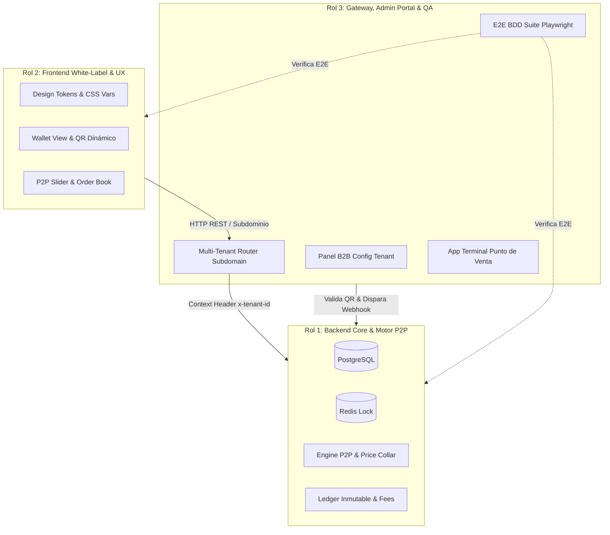

# Protocolo de Alineación y Contratos Compartidos (SMCTA)

> **Proyecto:** Sistema de Mercado Comportamental y Trading de Activos (SMCTA)  
> **Área:** Gestión de Proyecto y Arquitectura Distribuida  
> **Objetivo:** Definir los contratos de interfaz (APIs, Tipos, Eventos y Códigos de Error) inmutables para que los 3 integrantes del equipo desarrollen en paralelo de forma 100% independiente con sus respectivas IAs.

---

## 1. Principio de Desacoplamiento y Regla de Oro

Cada integrante tiene la propiedad absoluta (*ownership*) de su subsistema y **no debe esperar a que los otros terminen** para avanzar. Para lograr esto:
1. **Contratos Inmutables:** Los endpoints, DTOs, enumerados y códigos de error definidos en este documento son la única fuente de verdad técnica.
2. **Mocking First:** Frontend (Rol 2) e Infraestructura/QA (Rol 3) deben inicializar mocks tipados basados en los esquemas de este documento durante los primeros sprints, permitiendo avanzar sin esperar despliegues reales de Backend (Rol 1).
3. **Cero Dependencias Circulares:** Ningún componente puede depender en tiempo de compilación de la implementación interna de otro componente; solo de las interfaces y contratos REST/WebSocket/JSON aquí documentados.

---

## 2. Tipos y Modelos de Datos Compartidos (Shared TypeScript DTOs)

Todos los integrantes deben respetar estas estructuras de datos en sus respectivos repositorios o módulos:

```typescript
// ==========================================
// ENUMERADOS DEL SISTEMA
// ==========================================

export enum CouponState {
  EMITIDO = 'EMITIDO',
  EN_WALLET = 'EN_WALLET',
  PUBLICADO_P2P = 'PUBLICADO_P2P',
  CANJEADO = 'CANJEADO',
  VENCIDO = 'VENCIDO'
}

export enum OrderSide {
  BUY = 'BUY',
  SELL = 'SELL'
}

export enum OrderStatus {
  OPEN = 'OPEN',
  MATCHED = 'MATCHED',
  CANCELLED = 'CANCELLED'
}

export enum LedgerTransactionType {
  CHECKOUT = 'CHECKOUT',
  P2P_SPLIT = 'P2P_SPLIT',
  REDEEM_RELEASE = 'REDEEM_RELEASE',
  REFUND = 'REFUND'
}

// ==========================================
// DTOs Y ENTIDADES MAESTRAS
// ==========================================

export interface TenantConfigDTO {
  tenantId: string;
  companyName: string;
  subdomain: string;
  sellerTakeRatePct: number;    // Ej: 3.50 (%)
  buyerTakeRatePct: number;     // Ej: 2.50 (%)
  priceFloorPct: number;        // Ej: 50.00 (% del nominal)
  priceCeilingPct: number;      // Ej: 200.00 (% del nominal)
  maxDailyResalesPerUser: number; // Ej: 5
  closureHoursBeforeEvent: number;// Ej: 2 (horas antes para cerrar P2P)
  platformRevenueSharePct: number;// Ej: 30.00 (%)
  theme: {
    primaryColor: string;       // Ej: "#1A365D"
    accentColor: string;        // Ej: "#3182CE"
    surfaceColor: string;       // Ej: "#FFFFFF"
    fontFamily: string;         // Ej: "Inter, sans-serif"
    logoUrl: string;
  };
}

export interface CouponDTO {
  couponId: string;
  tenantId: string;
  currentOwnerId: string;
  nominalPrice: number;         // Ej: 100.00
  state: CouponState;
  qrEncryptedToken: string;     // Token criptográfico rotativo
  expirationDate: string;       // ISO-8601
  createdAt: string;
}

export interface P2POrderDTO {
  orderId: string;
  tenantId: string;
  couponId: string;
  sellerId: string;
  askingPrice: number;          // Precio de reventa propuesto
  side: OrderSide;
  status: OrderStatus;
  createdAt: string;
  commissionBreakdown: {
    nominalPrice: number;
    askingPrice: number;
    sellerFeePct: number;
    sellerFeeAmount: number;    // askingPrice * (sellerTakeRate / 100)
    netSellerProceeds: number;  // askingPrice - sellerFeeAmount
    buyerFeePct: number;
    buyerFeeAmount: number;     // askingPrice * (buyerTakeRate / 100)
    totalBuyerPrice: number;    // askingPrice + buyerFeeAmount
  };
}

export interface QRTokenPayload {
  couponId: string;
  tenantId: string;
  ownerId: string;
  nonce: string;                // Generado aleatoriamente cada 30 segundos
  timestamp: number;            // Epoch millis
  signature: string;            // HMAC-SHA256 firmado con clave secreta del tenant
}
```

---

## 3. Catálogo de Endpoints REST Oficiales

| Método | Endpoint | Responsable Productor | Consumidores | Descripción |
| :--- | :--- | :--- | :--- | :--- |
| `GET` | `/api/v1/tenant/config` | Rol 3 (Gateway/Context) | Rol 2 (Frontend) | Resuelve configuración y tema visual según subdominio. |
| `POST` | `/api/v1/checkout/primary` | Rol 1 (Backend Core) | Rol 2 (Frontend) | Compra inicial de cupón y fondeo de cuenta Escrow. |
| `GET` | `/api/v1/coupons/my-wallet` | Rol 1 (Backend Core) | Rol 2 (Frontend) | Retorna cupones del usuario autenticado con su estado. |
| `GET` | `/api/v1/coupons/:id/qr-token`| Rol 1 (Backend Core) | Rol 2 (Frontend) | Retorna token dinámico rotativo firmado para canje TPV. |
| `POST` | `/api/v1/p2p/orders` | Rol 1 (Backend Core) | Rol 2 (Frontend) | Publica orden en mercado P2P validando Price Collar. |
| `GET` | `/api/v1/p2p/orders` | Rol 1 (Backend Core) | Rol 2 (Frontend) | Listado público del libro de órdenes filtrado por Tenant. |
| `POST` | `/api/v1/p2p/orders/:id/buy` | Rol 1 (Backend Core) | Rol 2 (Frontend) | Ejecuta match atómico de compra P2P y split de fees. |
| `POST` | `/api/v1/tpv/validate-qr` | Rol 1 (Backend Core) | Rol 3 (TPV App) | Escanea QR, valida token, pasa estado a `CANJEADO` y emite webhook. |
| `POST` | `/api/v1/escrow/webhook-release`| Rol 1 (Backend Core)| Rol 3 (PSP Mock)| Libera balance de custodia tras confirmación de redención. |

---

## 4. Códigos de Error Semánticos Inflexibles

Cualquier error de negocio debe retornar formato estándar JSON:
```json
{
  "errorCode": "ERR_STRING_CODE",
  "message": "Descripción clara del motivo del rechazo.",
  "details": {}
}
```

| Código de Error | HTTP Status | Causa | Rol Responsable |
| :--- | :--- | :--- | :--- |
| `PRICE_COLLAR_VIOLATION` | `422 Unprocessable Entity` | Precio fuera del rango $[P_{min}, P_{max}]$ del Tenant. | Rol 1 |
| `COUPON_NOT_IN_WALLET` | `409 Conflict` | Intento de vender o canjear cupón que no está `EN_WALLET`. | Rol 1 |
| `P2P_ORDER_LOCKED` | `423 Locked` | Concurrencia detectada en Redis: orden en proceso de match. | Rol 1 |
| `DAILY_RESALE_LIMIT_REACHED` | `429 Too Many Requests`| Usuario superó las 5 reventas diarias parametrizadas. | Rol 1 |
| `QR_TOKEN_EXPIRED` | `401 Unauthorized` | Token QR tiene más de 30 segundos de antigüedad. | Rol 1 |
| `TENANT_NOT_FOUND` | `404 Not Found` | Subdominio no registrado en tabla `tenants`. | Rol 3 |

---

## 5. Matriz de Reparto de Responsabilidades


